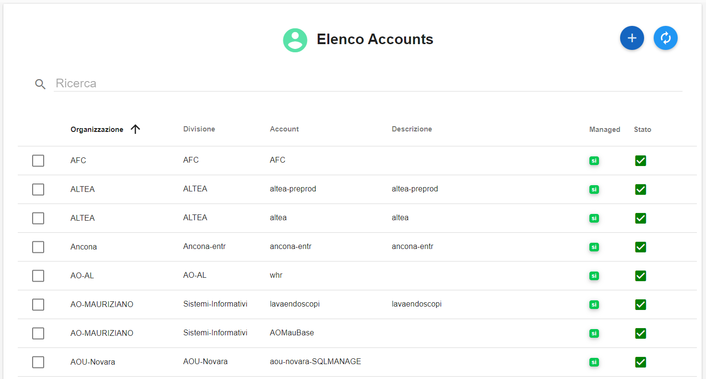
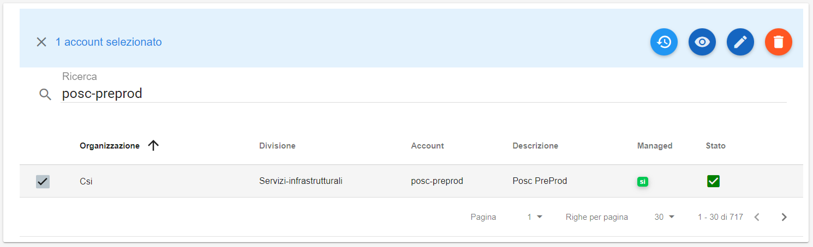
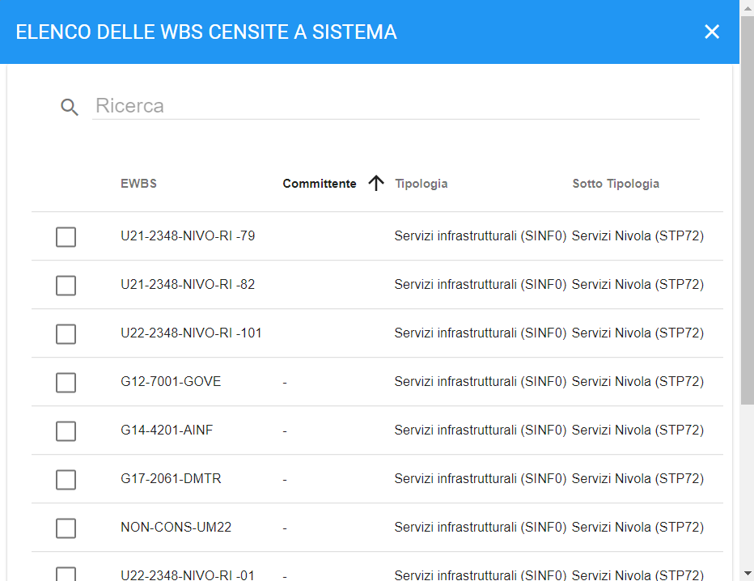
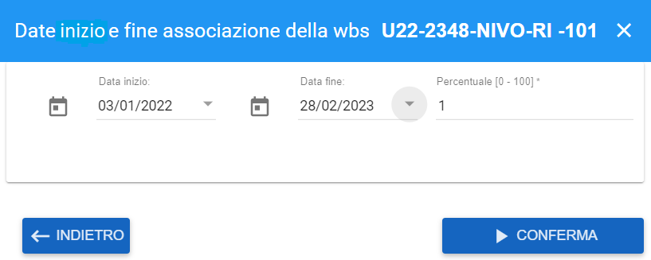

.. _Associazione_Listino_Account:

**WBS**
******************************

L'associazione di un codice WBS (Work breakdown Structure) ad un Account ha lo scopo di facilitare l’attività di avanzamento dei costi, 
contabilizzati mensilmente in Nivola (nella procedura Repository forniture).

E' necessario valorizzare i seguenti attributi:

- codice WBS con categoria tipologia e categoria sottotipologia

- data inizio / fine validità: si tratta dell’intervallo di date entro il quale avviene l’associazione

- WBS percentuale: è la percentuale del costo calcolato per il corrispondente consumo (metrica, account, giorno,...) che deve essere attribuita alla WBS. Default : 1 (100%).

La gestione del **WBS** è attivabile dalla voce servizio **Accounts** posto nella parte sinistra dello schermo, sotto la label **Struttura organizzativa**. 
Cliccando sulla freccia a destra della voce, apparirà **Accounts** e a seguito di un clic il sistema popolerà la parte centrale del video con l'Elenco degli accounts.

1. **Selezionare** l'account:

 

2. Usare il bottone **Modifica Elemento**:

.. image:: img/Pulsante_modifica.png
 

3. Spostarsi nel tag **WBS**
 

4. Premere il tasto "+" sotto **WBS**:

.. image:: img/Add_VM.png

5. Selezionare una delle **WBS** censite a sistema:

 

6. Sfruttando le combo box proposte inserire: data inizio, data fine, percentuale:

 
 
7. Controllare i dati inseriti e salvarli premendo sul pulsante **CONFERMA**:

