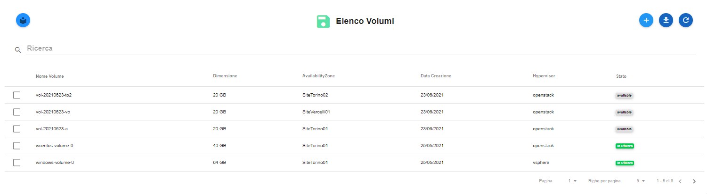

.. 45.0_Scaricare_Elenchi:

**Scaricare Elenchi in formato CSV**
************************************

In ogni elenco presente nel portale, esiste la funzione per poterlo scaricare nella propria
postazione in formato **CSV**. Per ottenere lo scopo, i passaggi sono seguenti:

1. Raggiunta la lista, in questo caso quella dei *Volumi*:

2. Premere il tasto **Scarica report csv**:

.. image:: img/Pulsante_scarica.png

3. Il sistema scaricherà l'elenco, in formato csv, nella postazione.