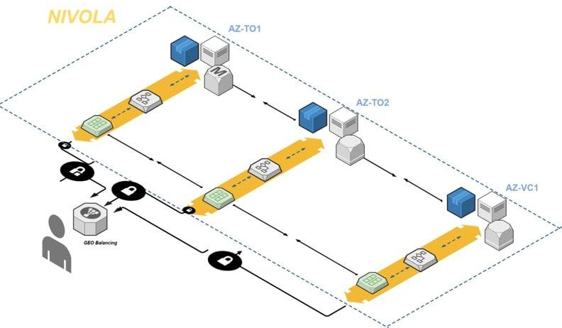
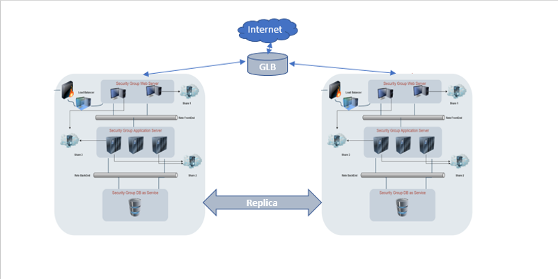

.. _Come_creare_servizi_in_alta_affidabilita:

**Come creare servizi in alta affidabilità**
********************************************

Sfruttando l’architettura multizone di Nivola è possibile creare servizi
altamente affidabili in grado di sopperire alla caduta di una delle 3 AZ all’interno della Region.
E’ utile riprendere il modello logico dell’architettura del Cloud regionale che riproduce in modo schematico
la presenza delle 3 AZ dislocate presso i datacenter di Torino e Vercelli, collegate tramite anello in fibra ottica
ad elevato throughput. L’utente può istanziare servizi in single-zone o in multi-zone. In questo secondo caso
basterà installare tutte le componenti applicative avendo cura di implementare le seguenti linee guida.

Prendendo ad esempio un’applicazione standard composta da front-end http, back-end per la logica
applicativa con middleware specifico, database server relazionale e storage condiviso è possibile realizzare
architetture applicative e quindi servizi altamente resilienti.

#. **BACKUP**: Avere cura di attivare i servizi di backup sulle componenti IaaS (virtual machine) e sui servizi di DBaaS implementando le politiche di retention più idonee per il servizio. Generalmente il backup viene effettuato tramite l’effettuazione di una snapshot giornaliera (ogni 24 ore) nella fascia oraria 18-6 e mantenuta per un periodo minimo di 14 giorni. Per i servizi di DBaaS oltre alla snapshot è garantito il backup logico dei dati (export) con retention che possono arrivare fino a 10 anni. Su richiesta ed in base alla criticità del servizio è possibile pianificare snapshot delle VM applicative anche ogni ora..
#. **STaaS**: il servizio di STaaS tipicamente utilizzato per la condivisione di volumi tra più virtual machine tramite protocolli nfs o cifs può essere allestito in modalità single-zone o in multi-zone. Per aumentare il livello di affidabilità è possibile richiedere il servizio STaaS in multi-zone con repliche fino ad ogni ora tra le zone di Torino e di Vercelli. In caso di failure di una delle zone sarà possibile montare i volumi dallo STaaS replicato.
#. **DBaaS**: per tutte le tecnologie presenti a catalogo è possibile implementare il servizio multi-zone con replica asincrona con RPO near 0,cioè con perdita dati in caso di incidente su una zona, vicino allo zero. Per i database di tipo SQL è possibile implementare esclusivamente un’architettura MASTER-REPLICA in modalità ACTIVE-PASSIVE. E’ cioè necessario pilotare manualmente lo switch del servizio tra una zona geografica e l’altra.
#. **COMPUTE**: le virtual machine sono disponibili nativamente nella sola modalità single-zone. Ciò significa che la realizzazione di un’architettura multi-zone per le componenti applicative di frontend e di back-end va realizzata manualmente dall’utente attraverso l’allestimento di virtual machine presso 2 differenti availability zone poste in data center differenti. Sarà poi necessario implementare strumenti che permetta o di mantenere allineate tutte le istanze applicative in ciascuna delle zone. A questo scopo tornano utili strumenti di automazione del deploy, snapshot con copia remota o l’utilizzo di strumenti nativi di allineamento filesystem (es: rsync) pilotabili con procedure schedulate.
#. **BILANCIATORI LOCALI**: l’utilizzo di bilanciatori locali permette di garantire all’interno di ciascuna AZ un alto livello di affidabilità applicativa in particolare per le componenti di front-end e di back-end tipicamente basati su protocollo http/https. In questo caso il servizio sarà raggiungibile dalle reti esterne tramite un VIP (Virtual IP) che si occuperà di indirizzare il traffico verso le istanze di frontend e di bac-end attive.
#. **REGOLE DI ANTI-AFFINITY**: è possibile richiedere l’implementazione di regole di anti-affinity su gruppi di virtual machine in modo che in ogni momento ne sia garantita la loro esecuzione su server fisici differenti in modo che la caduta di un nodo fisico non infici mai la continuità di erogazione del servizio. Tipicamente si suggerisce la creazione di gruppi di anti-affinity formati da virtual machine che ospitano servizi applicativi bilanciati tramite bilanciatore locale.
#. **BILANCIATORE GEOGRAFICO**: l’utilizzo del bilanciatore geografico (Global Load Balancer – GLB) permette di delegare una particolare zona DNS o uno specifico FQDN al GLB di Nivola in modo che questo si occupi automaticamente di dirigere il traffico applicativo proveniente dall’esterno verso i VIP attivati presso ciascuna AZ in cui l’applicativo è attivo. In caso di failure di una AZ, il GLB dirigerà il traffico verso la AZ attiva. Una tale funzionalità è adatta soprattutto per applicazioni in grado di supportare il modello active-active, in cui cioè l’applicazione è sempre attiva su più zone geografiche. In questo modello gli utenti fruitori del servizio applicativo sono sempre distribuiti dal GLB su tutte le AZ in cui il servizio è presente ed è attivo.

