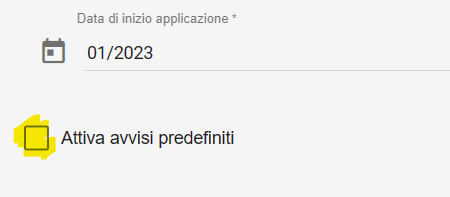
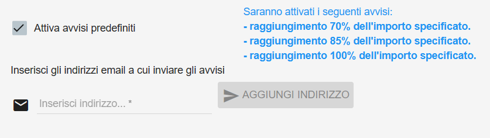
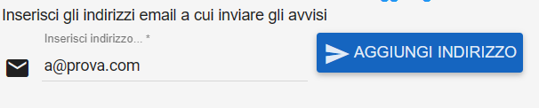
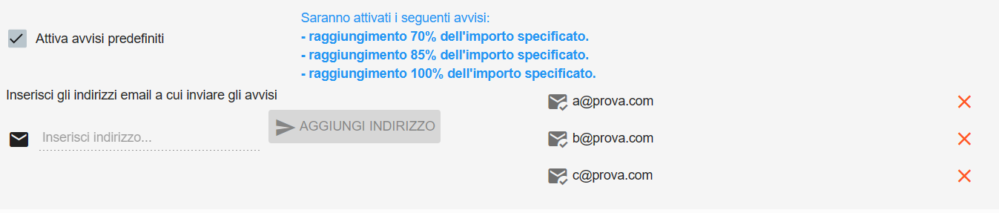
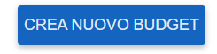
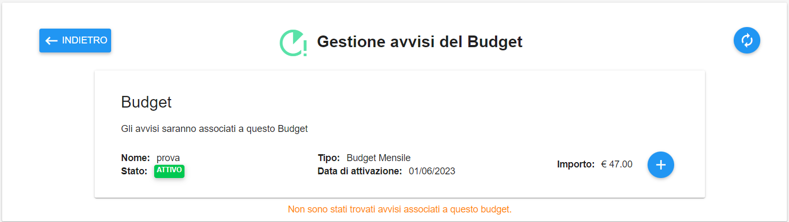
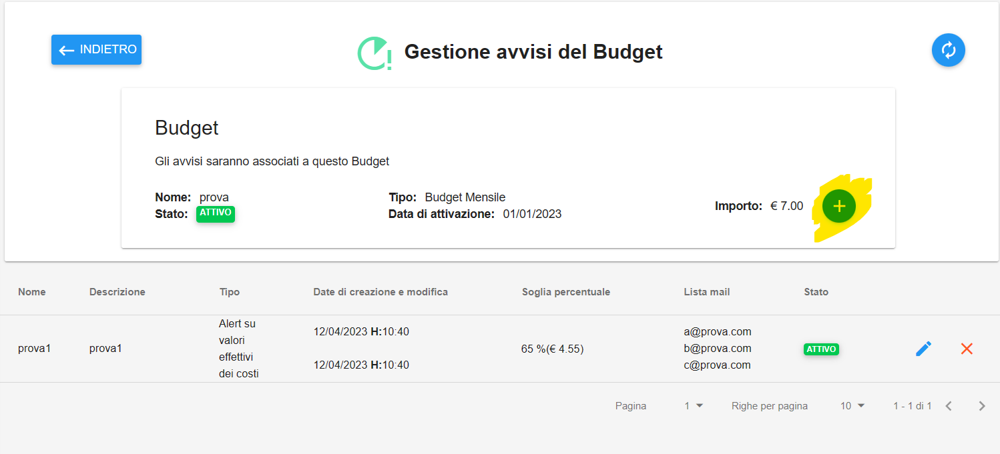
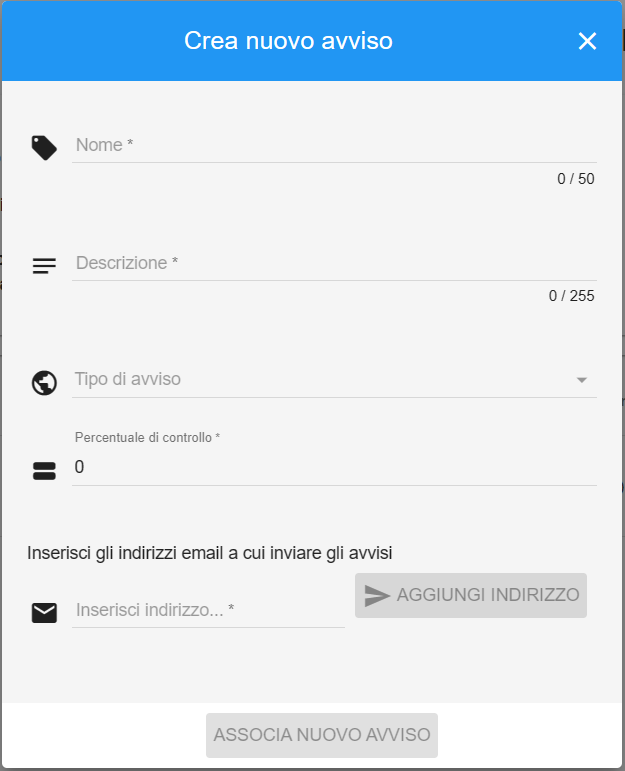
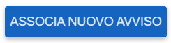
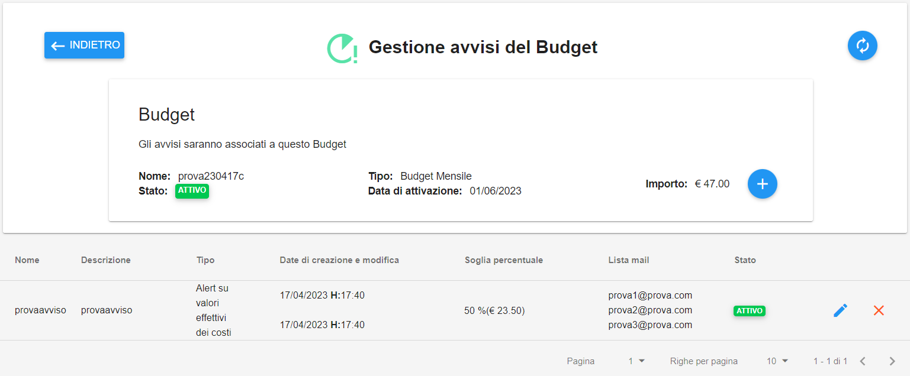

.. _Creare_Avvisi:

**Creare Avvisi**
=================

Esistono due modalità per **Creare gli Avvisi** associati ad un budget:

- Il primo metodo può essere applicato direttamente durante la creazione di un budget, attraverso la creazione di tre Avvisi automatici che si attivano al raggiungimento del 70%, dell'85% e del 100% della cifra di budget totale

- Il secondo metodo, post creazione Budget, permette di gestire in totale libertà gli avvisi collegati al budget selezionato

**Creazione Avviso durante creazione di un budget**
***************************************************

1. Iniziare il processo di creazione del budget, inserendo tutti i dati richiesti

.

2. Selezionare il checkbox **Attiva avvisi predefiniti**

3. Verranno visualizzate le seguenti informazioni

4. Inserire da 1 a 3 indirizzi email sui quali ricevere gli avvisi, scrivendo l’indirizzo nella casella “Inserisci indirizzo…” e premendo su **AGGIUNGI INDIRIZZO** a fine inserimento

5. Gli indirizzi email appena salvati saranno riportati a destra, con possibilità di eliminazione nel caso di errori

6. Una volta salvate tutte le email corrette, premere sul bottone **CREA NUOVO BUDGET**

**Creazione Avviso post creazione Budget**
******************************************

1. Accedere alla pagina **Gestione avvisi del Budget**

2. Premere sul bottone **+** vicino all’importo del budget

3. Si aprirà la pagina **   Crea nuovo Avviso**, con i seguenti campi da popolare

4. Completato l’inserimento di dati ed email (come nella precedente modalità di creazione), premere il pulsante **ASSOCIA NUOVO AVVISO*

5. Il nuovo avviso sarà ora attivo e visualizzabile nell’elenco degli **Avvisi associati al budget**

