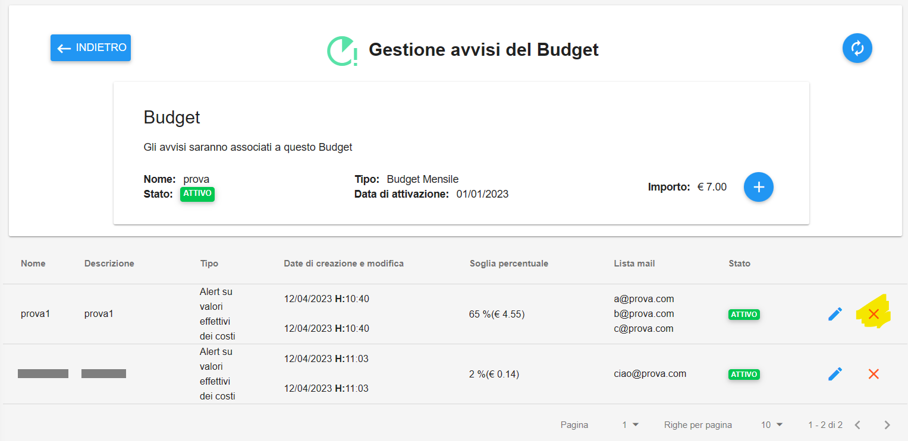
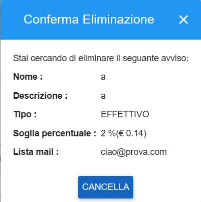

.. _Cancellare_Avvisi.rst:

**Cancellare Avvisi**
=====================

Per **Cancellare un Avviso** procedere con le seguenti operazioni:

1. Accedere alla pagina **Gestione avvisi del Budget**

.. image:: img/8.13_ListaAvvisi_Pre_Delete.png

2. Individuare l'Avviso da cancellare, quindi cliccare sul simbolo della **X** rossa sulla destra all'interno della corrispondente riga

3. Confermare l’eliminazione dal popup, premendo sul bottone **CANCELLA**

