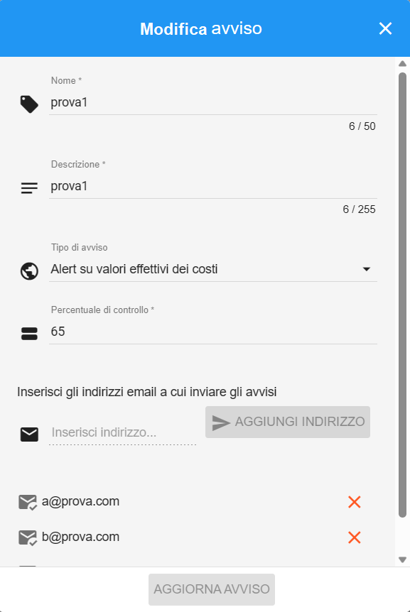

.. _Modificare_Avvisi.rst:

**Modificare Avvisi**
=====================

Per **Modificare un Avviso** procedere con le seguenti operazioni:

1. Partire dall’elenco degli **Avvisi associati ad un Budget**

.. image:: img/8.15_ListaAvvisi_Pre_Modifica.png

2. Individuare l'Avviso da cancellare, quindi cliccare sul simbolo della **matita** blu sulla destra all'interno della corrispondente riga

3. Si aprirà una finestra per la modifica dell’Avviso

4. Una volta modificati i campi desiderati (indirizzi mail compresi), premere sul bottone **AGGIORNA AVVISO** per confermare i cambiamenti appena eseguiti

5. La modifica sarà presente nell’elenco degli Avvisi associati al budget
