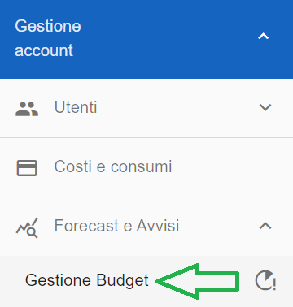
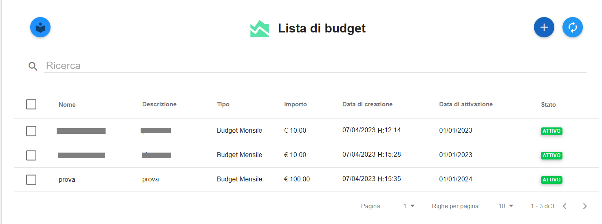
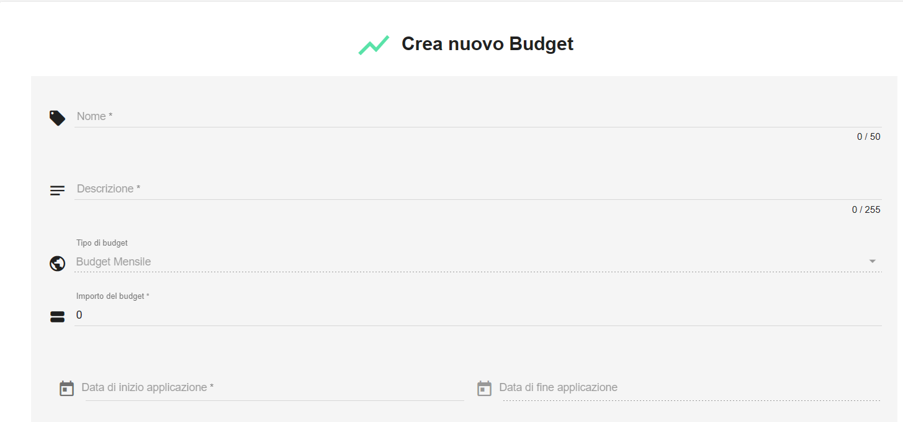
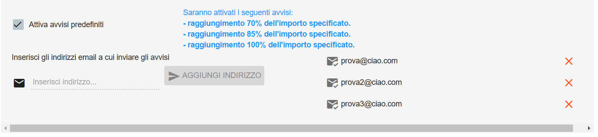

.. _Creare_Budget:

**Creare Budget**
=================

La funzione rientra nella sezione **Gestione Account**. La **creazione di un Budget** 
è attivabile dalla parte sinistra dello schermo, cliccando sulla label **Budget e Avvisi**

A seguito di un click su **Budget e Avvisi**, il sistema popolerà la parte destra della pagina 
web con l’**elenco dei budget**, se presenti.
In alternativa verrà visualizza la scritta “Non sono presenti budget per questo account”.

Per la **creazione di un budget**, procedere in questo modo:

Cliccare sul bottone **Aggiungi nuovo budget** in alto a destra

Verrà aperta la pagina **Crea nuovo Budget**

1. Inserire il Nome e la Descrizione
2. Il Tipo del budget (attulamente solo Mensile)
3. L’Importo del budget, la cifra numerica che rappresenta il limite economico da non superare
4. La Data di inizio e fine Applicazione del budget, in mesi e anni (MM/YYYY)
5. Spuntare la casella Attiva avvisi predefiniti, se si desidera ricevere degli avvisi via mail al raggiungimento del 70, 85 e 100% dell’importo indicato in precedenza
6. Inserire da 1 a 3 indirizzi mail, per ricevere nella propria casella di posta le notifiche di raggiungimento della soglia

Infine confermare il budget appena creato, premendo sul bottone **CREA NUOVO BUDGET**, in basso a destra

.. image:: img/8.1_PulsanteCrea.png

Il budget sarà visualizzato nell’elenco dei budget attivi per l’account nel quale è stato creato
