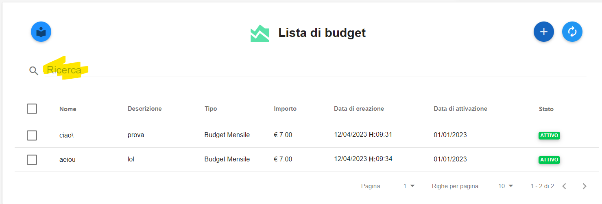

.. _Cercare_Budge:

**Cercare Budget**
==================

All’interno di ciascun Account è possibile fare **ricerche** su tutti i budget creati. La ricerca è eseguita tramite una stringa inserita dall’operatore.
Nivola ricerca il set di caratteri nelle colonne **Nome** e **Descrizione**.
Per eseguire una ricerca è necessario procedere in questo modo:

1. Inserire la stringa da usare come chiave di ricerca, sotto la label **Ricerca** e premere invio

2. Il sistema popolerà lo schermo, con i budget che soddisfano il criterio di selezione

.. image:: img/8.3_BudgetTrovatoDX.png
