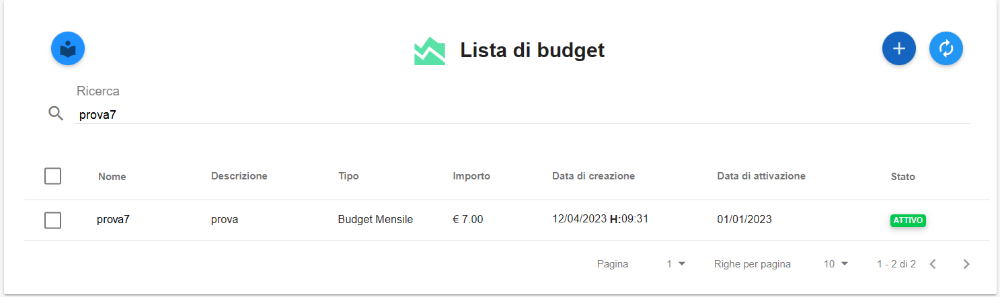

.. _Cancellare_Budget:

**Cancellare uno o più Budget**
===============================

Per **cancellare** uno o più Budget procedere con le seguenti operazioni:

1. Selezionare dal checkbox laterale sinistro i budget da cancellare

.. image:: img/8.5_SelezionaXCancBudget.png

2. Il sistema popolerà lo schermo, con i budget che soddisfano il criterio di selezione

3. Cliccare sul tasto **Elimina Budget**

.. image:: img/8.5_EliminaBudget.png

4. Confermare l’eliminazione premendo sul bottone **PROCEDI**

.. image:: img/8.5_ConfermaCancella.png

5. Il budget sarà cancellato e, di conseguenza, scomparirà dalla lista dei budget e dal grafico dei Costi e Consumi

.. image:: img/8.5_dopoCancella.png
