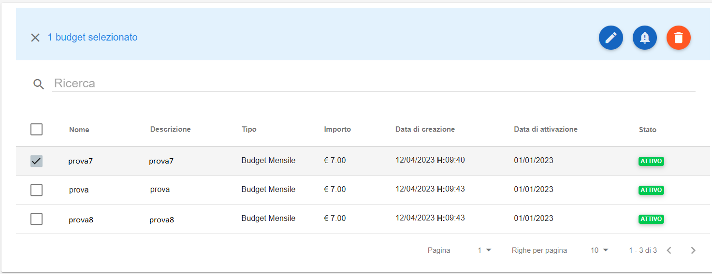
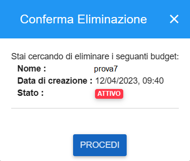
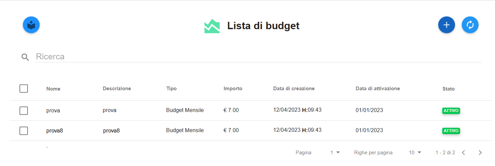

.. _Cancellare_Budget:

**Cancellazione Budget**
===============================

Per **cancellare** uno o più Budget procedere con le seguenti operazioni:

1. Selezionare dal checkbox laterale sinistro i budget da **cancellare**

2. Cliccare sul tasto **Elimina Budget**

3. Confermare l’eliminazione premendo sul bottone **PROCEDI**

4. Il budget sarà cancellato e, di conseguenza, scomparirà dalla lista dei budget e dal grafico dei Costi e Consumi

