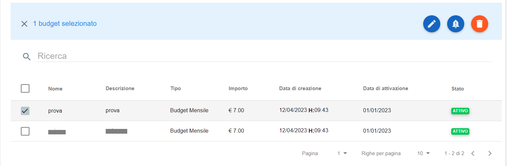
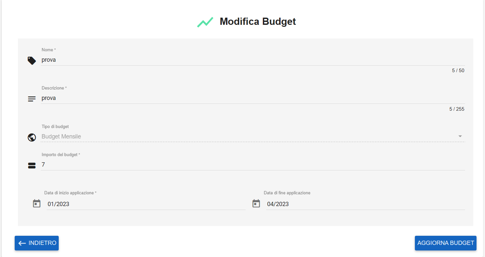
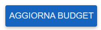
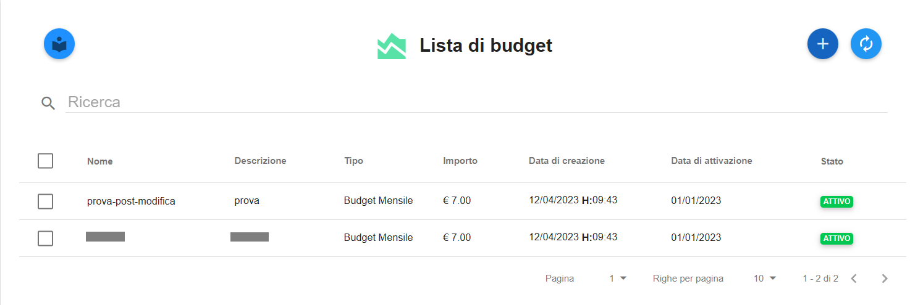

.. _Modificare_Budget:

**Modificare Budget**
=====================

Il sistema consente la **modifica** di un budget alla volta, procedendo in questo modo:

1. Selezionare un budget dal checkbox a sinistra del **Nome** nell’apposita lista

2. Premere il bottone **Modifica** in alto a destra 

3. Modificare i campi desiderati, tenendo sempre conto della formalità applicata

4. Premere il bottone **AGGIORNA BUDGET** per salvare e rendere effettivi i dati appena modificati

5. I dati sono stati aggiornati nell’elenco budget e nel grafico Costi e Consumi

