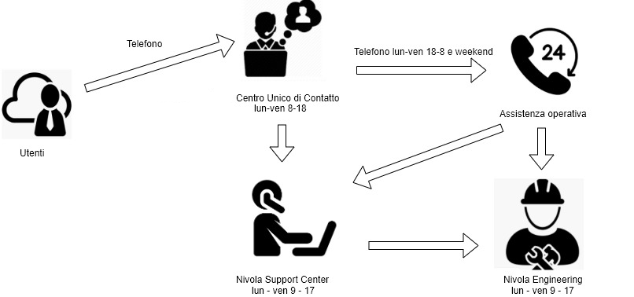
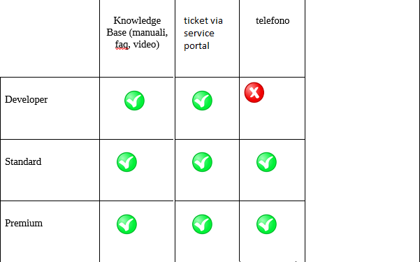

.. _Attivare_il_supporto:

**Come attivare il Supporto**
*****************************

Le attività di assistenza relative al Service Portal Nivola e a tutti i
servizi fruibili non possono prescindere dai livelli di servizio
individuati nonché degli strumenti adottati per l’erogazione dei servizi
di assistenza.

L’attività di assistenza all’interno del Team di Supporto Nivola è
articolata su uno schema di supporto basato su tre livelli:

#. Developer: chat, compilazione form su SP

#. Standard: chat, compilazione form su SP, invio e-mail, contatto
   telefonico

#. Premium: chat, compilazione form su SP invio e-mail, contatto
   telefonico

Per quanto riguarda la copertura oraria e Livelli di Servizio fare
riferimento all’\ `Allegato tecnico del Catalogo Servizi Nivola. <http://intranet.csi.it/monitoraggio/dwd/2019/Catalogo-e-Listino-CSI-2019-04-Allegato-tecnico-Servizi-Nivola.pdf>`__

Tutti i canali, ad eccezione della chat, sono presidiati dal **Centro
Unico di Contatto (CUC)** nella fascia lavorativa dal lunedì al venerdì
dalle 8 alle 18. Per le restanti fasce orarie è possibile avere un
riscontro immediato solo attraverso il canale telefonico garantito dal
gruppo Conduzione Operativa.

Il Centro Unico di Contatto inoltra la richiesta al **Nivola Support
Center (NSC)** tramite lo strumento di ticketing. Nel caso in cui, la
problematica non possa essere risolta da NSC viene inoltrata al gruppo
di Ingegneria Nivola.

Durante l’orario presidiato dal gruppo **Assistenza Operativa**, nel caso
non fossero in grado di risolvere la probletica evidenziata dall’utente,
sarà chiamato il reperibile del gruppo di NSC o di Ingegneria.

L’utente ha a disposizione all’interno del Service Portal Nivola una
sezione specifica dove può trovare le informazioni di base relative
all’utilizzo della piattaforma.

In particolare sono disponibili:

-  manuali utente sull’utilizzo della piattaforma;

-  eventuali video esplicativi per la verifica e l’utilizzo di
   funzionalità specifiche;

-  FAQ per la risoluzione dei problemi più comuni.

Qualora l’utente/cliente, attraverso l’utilizzo di questi strumenti non
trovasse la risposta alla sua problematica ha a disposizione alcuni
strumenti interattivi che gli permettono di comunicare direttamente con
il Team di Supporto Nivola:

-  chat attivabile dal Service Portal

-  compilazione form su Service Portal

L’accessibilità ai singoli strumenti di assistenza è diversa a seconda
dei singoli livelli di servizio attivati dall’utente/cliente (cfr.
tabella di seguito riportata):

Le 3 tipologie di supporto sono collegate all’istanza di servizio. Ad
esempio il cliente può attivare 2 istanze di DBaaS richiedendo il
supporto Developer sull’istanza di Test e un supporto Premium per
l’istanza di produzione purchè appartenenti ad Account differenti.

**Riferimenti per il Supporto**

Il Supporto è attivabile dagli utenti esterni sui seguenti canali

Service Portal: chat, compilazione form su Service Portal

**E-mail** alla casella: hd_servizinivola@csi.it

**Telefono** Centro Unico di Contatto: +39 011 0824221

Dal mese di Marzo, è stata attivata la nuova modalità per richiedere assistenza all'interno della sezione privata del Service Portal di Nivola:

https://www.nivolapiemonte.it/

Ricordiamo che l'accesso avviene tramite Spid o con Carta d'Identità Elettronica.

Nel caso non foste abilitati sui vostri account Nivola è necessario inviare la richiesta di creazione utenza ed associazione con i seguenti dati:

⦁ Nome
⦁ Cognome
⦁ Codice Fiscale
⦁ Indirizzo Email
⦁ Account Nivola a cui richiedete l'accesso
⦁ Referente dell'account nivola
⦁ Ruoli da assegnare all'utente (Viewer account, Master Account)

I dati devono essere inviati da un referente già abilitato su Service Portal, oppure in caso di nuovo account Nivola contattando il Call center CSI Piemonte al numero 0110824221 

**La casella di posta hd_servizinivola@csi.it sarà definitivamente dismessa in data 30/05/2022**

Solo per i dipendenti e consulenti CSI è possibile aprire il ticket anche attraverso il sistema aziendale di ticketing  Self Help READY2USE

Nei paragrafi sottostanti è inoltre possibile trovare la sezione specifica relativa all'uso del sistema di ticketing da Service Portal Nivola

.. toctree::
    ../Come_fare_per/100.0_Assistenza.rst

