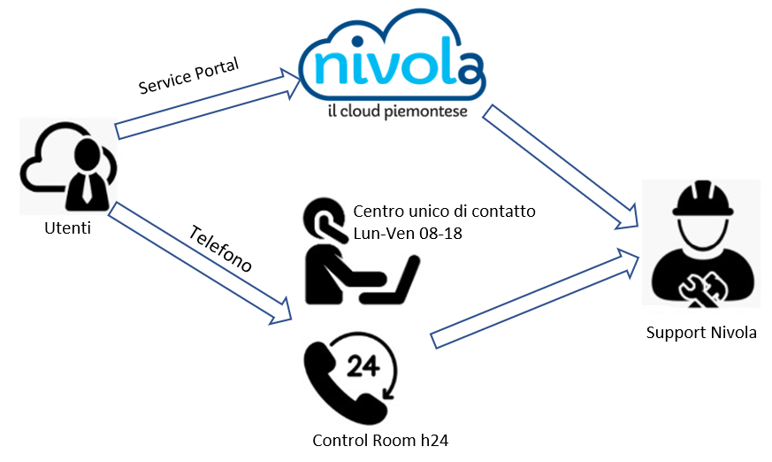

.. _Attivare_il_supporto:

**Come attivare il Supporto**
*****************************

Le attività di assistenza relative al Service Portal Nivola e a tutti i servizi fruibili non possono prescindere dai livelli di servizio individuati nonché 
degli strumenti adottati per l’erogazione dei servizi di assistenza.
L’attività di assistenza all’interno del Team di Supporto Nivola è articolata su uno schema di supporto basato su tre livelli:

1.	Developer: compilazione Ticket su SP

2.	Standard: compilazione Ticket su SP, contatto telefonico

3.	Premium: compilazione Ticket su SP, contatto telefonico

Per quanto riguarda la copertura oraria e Livelli di Servizio fare
riferimento all’\ `Allegato tecnico del Catalogo Servizi Nivola. <http://intranet.csi.it/monitoraggio/dwd/2019/Catalogo-e-Listino-CSI-2019-04-Allegato-tecnico-Servizi-Nivola.pdf>`__

Tutti i canali sono presidiati dal **Centro
Unico di Contatto (CUC)** nella fascia lavorativa dal lunedì al venerdì
dalle 8 alle 18. Per le restanti fasce orarie è possibile avere un
riscontro immediato solo attraverso il canale telefonico garantito dal
gruppo Conduzione Operativa.

Il Centro Unico di Contatto inoltra la richiesta al **Nivola Support
Center (NSC)** tramite lo strumento di ticketing. Nel caso in cui, la
problematica non possa essere risolta da NSC viene inoltrata al gruppo
di Ingegneria Nivola.

Durante l’orario presidiato dal gruppo **Assistenza Operativa**, nel caso
non fossero in grado di risolvere la probletica evidenziata dall’utente,
sarà chiamato il reperibile del gruppo di NSC o di Ingegneria.

L’utente ha a disposizione all’interno del Service Portal Nivola una
sezione specifica dove può trovare le informazioni di base relative
all’utilizzo della piattaforma.

In particolare sono disponibili:

-  manuali utente sull’utilizzo della piattaforma;
-  eventuali video esplicativi per la verifica e l’utilizzo di funzionalità specifiche;
-  FAQ per la risoluzione dei problemi più comuni.

L’accessibilità ai singoli strumenti di assistenza è diversa a seconda
dei singoli livelli di servizio attivati dall’utente/cliente (cfr.
tabella di seguito riportata):

.. image:: img/90.0_certificazioni_gdpr.png

Le 3 tipologie di supporto sono collegate all’istanza di servizio. Ad
esempio il cliente può attivare 2 istanze di DBaaS richiedendo il
supporto Developer sull’istanza di Test e un supporto Premium per
l’istanza di produzione purchè appartenenti ad Account differenti.

**Riferimenti per il Supporto**

Il Supporto è attivabile dagli utenti esterni sui seguenti canali

Service Portal: Sezione Assistenza su Service Portal

**Telefono** Centro Unico di Contatto: +39 011 082422
