**Modifica Account (amministratore di backoffice)**
***************************************************

    1. :ref:`Anagrafica Account`
    2. :ref:`Listini e Costi`
    3. :ref:`Utenti`    
    4. :ref:`Capabilities`
    5. :ref:`Servizi di Gestione Abilitati`
    6. :ref:`Allegati`
    7. :ref:`WBS`
    8. :ref:`Ricalcola Costi`
    9. :ref:`Anagrafica Prodotti`
    10. :ref:`Forecast e Budget`

|

.. _Anagrafica Account:

**Anagrafica Account**
======================

Da questo tab è possibile modificare i dettagli dell'account

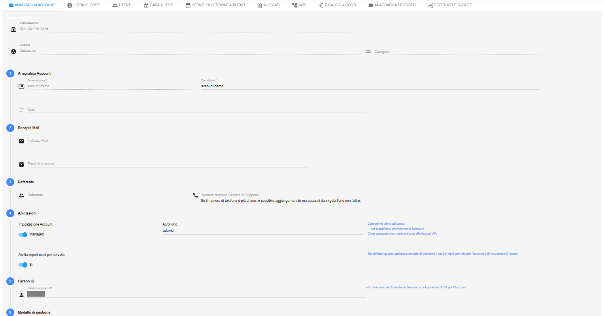

|

.. _Listini e Costi:

**Listini e Costi**
===================

Da questo tab è possibile visualizzare e modificare (attraverso i tasti "+" e del cestino in basso) i Listini abilitati per l'account

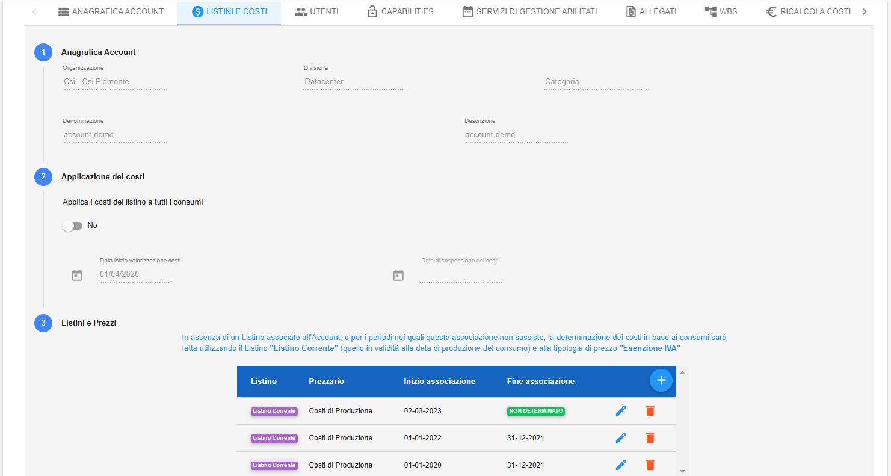

|

.. _Utenti:

**Utenti**
==========

Da questo tab è possibile:

-  visualizzare i ruoli degli Utenti abilitati all'utilizzo dell'account

-  modificare i ruoli degli Utenti abilitati all'utilizzo dell'account: selezionando l'utente e utilizzando il tasto "Accredita utente" oppure il tasto a forma di cestino

-  modificare i dati dell'Utente abilitato all'utilizzo dell'account: selezionando l'utente e utilizzando il tasto a forma di matita

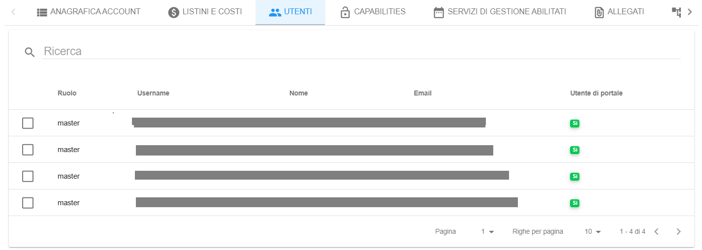

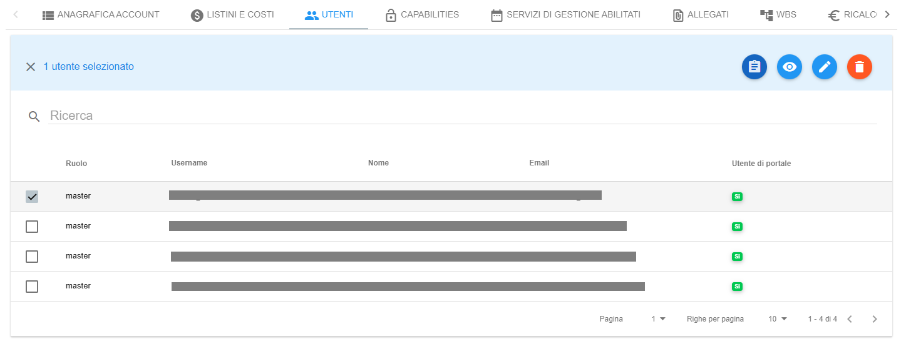

|

.. _Capabilities:

**Capabilities**
================

Da questo tab è possibile abilitare le Capabilities dell'account, attraverso i tasti ABILITA e AGGIORNA

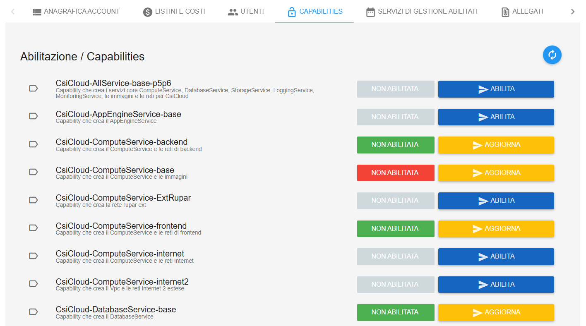

|

.. _Servizi di Gestione Abilitati:

**Servizi di Gestione Abilitati**
=================================

Da questo tab è possibile visualizzare e aggiungere (attraverso il tasto "+") tutti i Servizi di Gestione abilitati per l'account

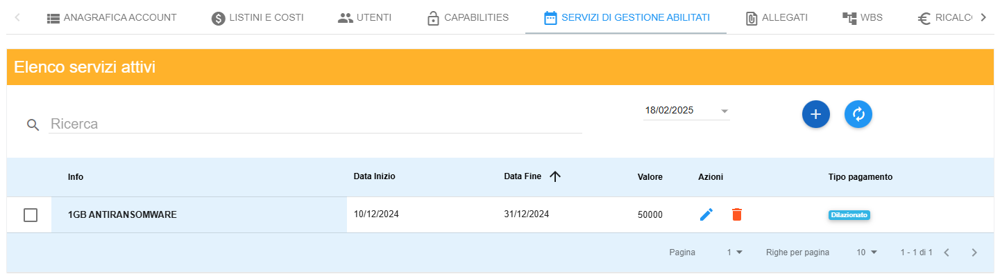

|

.. _Allegati:

**Allegati**
============

Da questo tab è possibile visualizzare ed aggiungere allegati associati all’account (utilizzando il tasto "Carica nuovo documento")

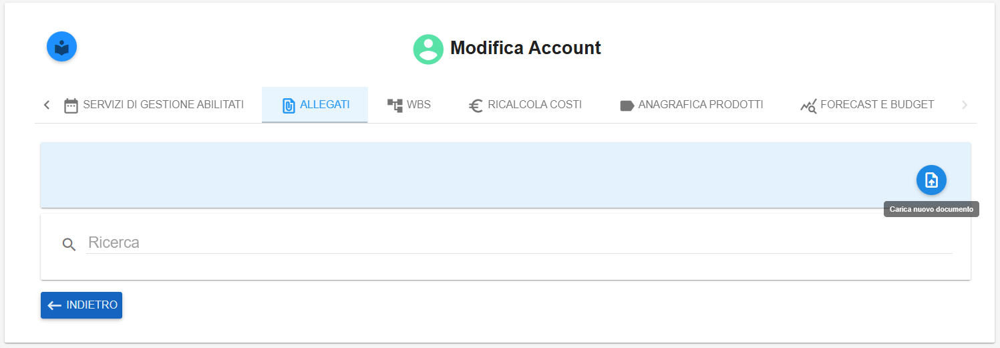

|

.. _WBS:

**WBS**
=======

Da questo tab è possibile visualizzare e modificare (attraverso i tasti "+" e a forma di matita) le ripartizioni WBS dell'account.
L’associazione di un codice WBS (Work breakdown Structure) ad un Account ha 
lo scopo di facilitare l’attività di avanzamento dei costi, contabilizzati mensilmente in Nivola

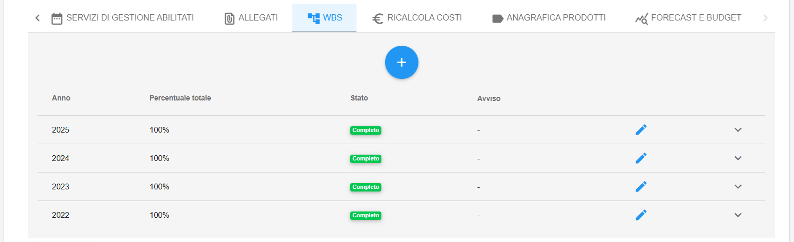

|

.. _Ricalcola Costi:

**Ricalcola Costi**
===================

Da questo tab è possibile ricalcolare i costi dell'account: è sufficiente impostare la data da cui partire e quindi cliccare su RICALCOLA

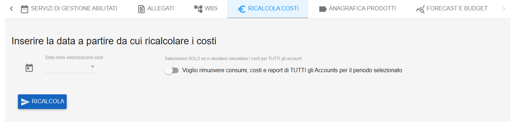

|

.. _Anagrafica Prodotti:

**Anagrafica Prodotti**
=======================

Da questo tab è possibile visualizzare l’eventuale presenza di codice-prodotto associati all’account

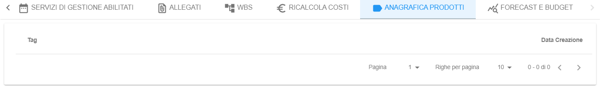

|

.. _Forecast e Budget:

**Forecast e Budget**
=====================

La sezione del forecasting consente di simulare una previsione di andamento dei propri consumi in base 
ai costi già registrati (funzionalità legata al ricalcolo dei costi).

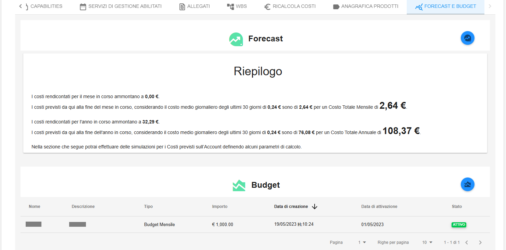
