**Visualizza Dettaglio Account (amministratore di backoffice)**
***************************************************************

    1. :ref:`Dettaglio`
    2. :ref:`Utenti`
    3. :ref:`Consumi`    
    4. :ref:`WBS`
    5. :ref:`Servizi`
    6. :ref:`Quote`
    7. :ref:`Servizi di Gestione Abilitati`
    8. :ref:`Anagrafica Prodotti`
    9. :ref:`Allegati`

.. _Dettaglio:

**DETTAGLIO**
=============

Da questo tab è possibile visualizzare i dettagli dell'account

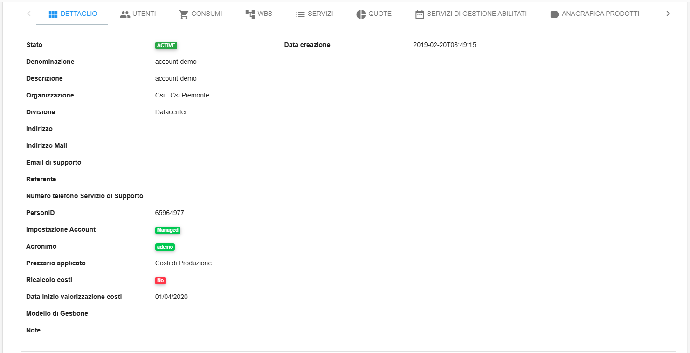

|

.. _Utenti:

**UTENTI**
==========

Da questo tab è possibile visualizzare gli utenti e i relativi ruoli abilitati all'utilizzo dell'account

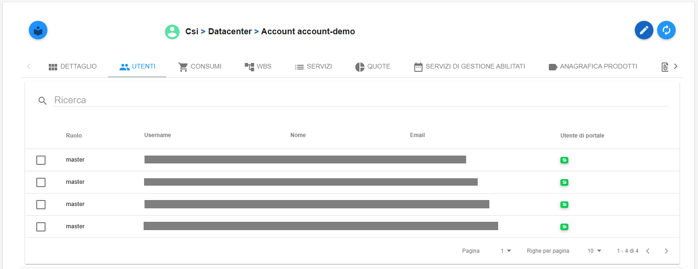

|

.. _Consumi:

**CONSUMI**
===========

Da questo tab è possibile visualizzare i consumi dell'account

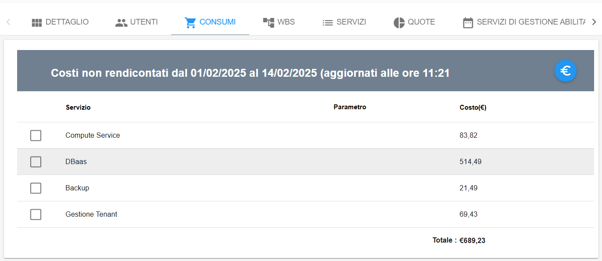

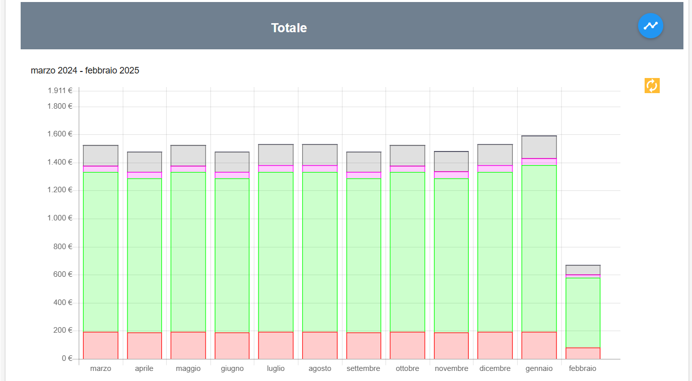

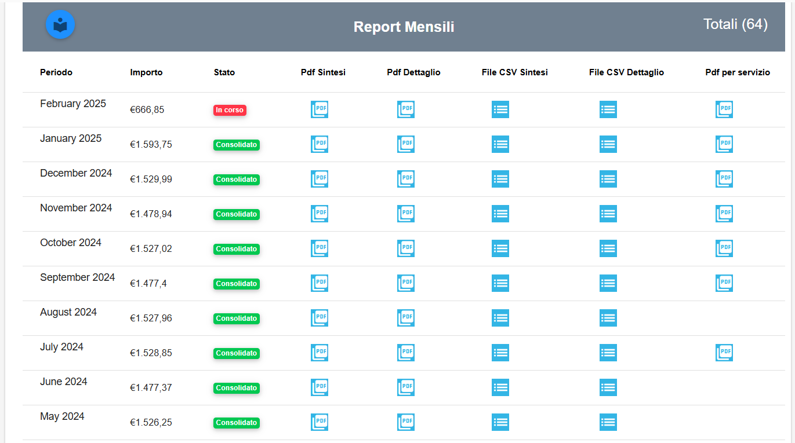

|

.. _WBS:

**WBS**
=======

Da questo tab è possibile visualizzare le ripartizioni WBS dell'account.
L’associazione di un codice WBS (Work breakdown Structure) ad un Account ha 
lo scopo di facilitare l’attività di avanzamento dei costi, contabilizzati mensilmente in Nivola

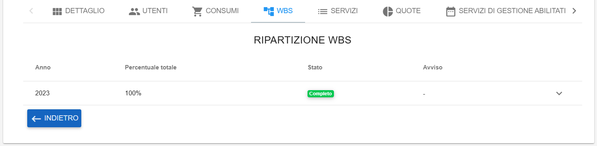

|

.. _Servizi:

**SERVIZI**
===========

Da questo tab è possibile visualizzare tutti i servizi facenti capo all'account

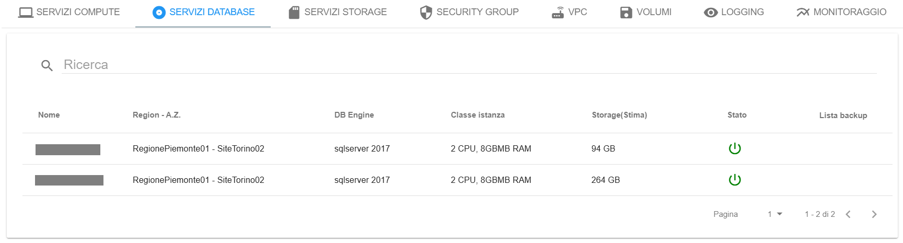

**Servizi Compute**: elenco e dettagli delle Virtual Machine

**Servizi Database**: elenco e dettagli dei Database as a Service

**Servizi Storage**: elenco e dettagli dei Storage as a Service

**Security Group**: elenco e dettagli dei Security Group con le relative configurazioni/regole di rete

**VPC**: elenco e dettagli dei VPC, Virtual Private Clud, contenenti i Security Group e con l'obiettivo di isolare le varie organizzazioni

**VOLUMI**: elenco e dettagli dei Volumi delle Virtual Machine

**LOGGING**: elenco e dettagli dei Logging as a Service eventualmente installati nelle Virtual Machine

**MONITORAGGIO**: elenco e dettagli dei Monitoring as a Service eventualmente installati nelle Virtual Machine

|

.. _Quote:

**QUOTE**
=========

Da questo tab è possibile visualizzare le quote di utilizzo di tutti i servizi facenti capo alle risorse dell'account

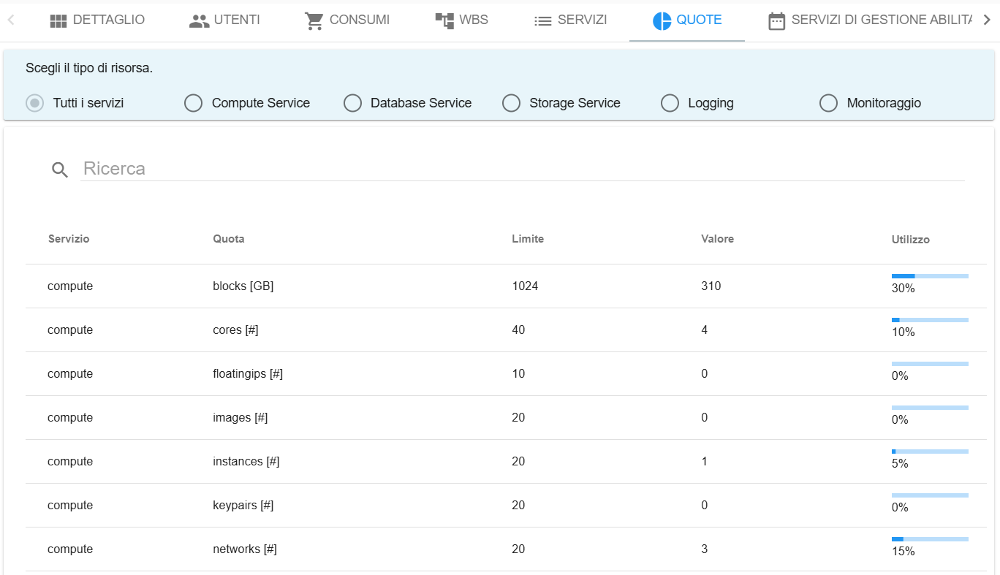

|

.. _Servizi di Gestione Abilitati:

**SERVIZI DI GESTIONE ABILIATI**
================================

Da questo tab è possibile visualizzare tutti i Servizi di Gestione abilitati per l'account

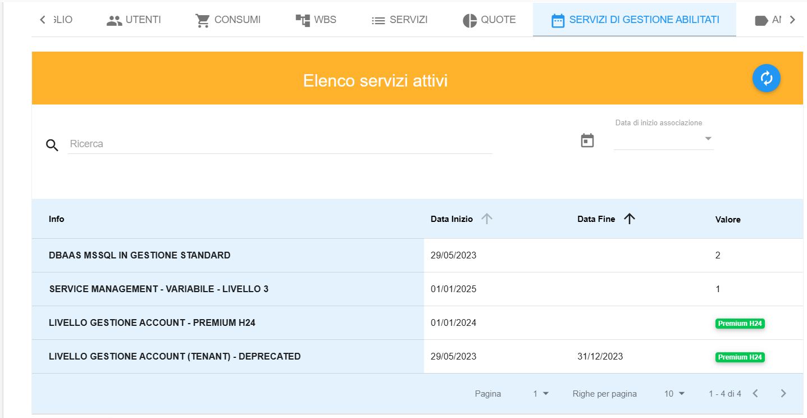

|

.. _Anagrafica Prodotti:

**ANAGRAFICA PRODOTTI**
=======================

Da questo tab è possibile visualizzare l’eventuale presenza di codice-prodotto associati all’account

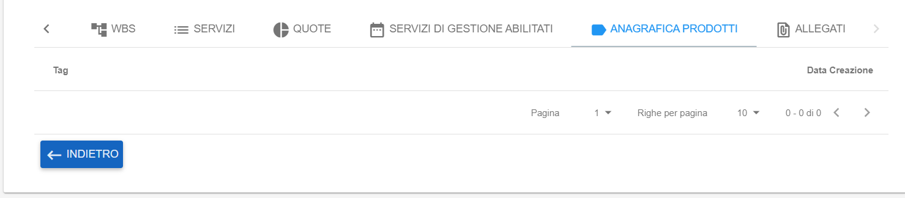

|

.. _Allegati:

**ALLEGATI**
============

Da questo tab è possibile visualizzare l’eventuale presenza di allegati associati all’account

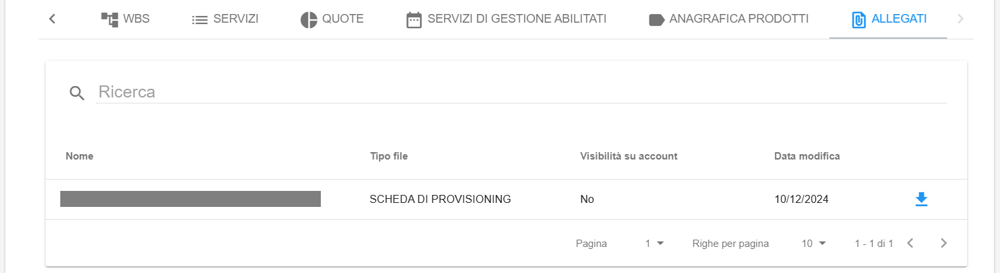
