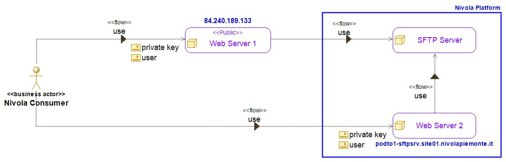

.. _10_Funzionalità_import_export_dati:

**Funzionalità per l'import e l'export dei dati**
=================================================

Nel servizio SFTP su Nivola vengono definite le utenze utilizzate per il trasferimento dei files da e verso l’ambiente Nivola.

Per i trasferimenti all’interno di Nivola (ambienti enterprise) si utilizza un IP privato (nome del servizio  podto1-sftpsrv.site01.nivolapiemonte.it). 
Per i clienti/fornitori esterni si ricorre all’abilitazione di un IP pubblico: l’attività prevede l’abilitazione sul vSphere di riferimento, oltre che una 
abilitazione a livello di rete sui firewall perimetrali.

Le richieste di abilitazione normalmente arrivano al Supporto Nivola, che abilita le utenze al servizio (principalmente per scopi temporanei). Altri enti 
esterni possono utilizzare il servizio massivamente per trasferire e interscambiare dati e files. 

Le operazioni, eventualmente anche proceduralizzate, utilizzano il comando sftp (su piattaforma linux) oppure tool grafici in ambiente Microsoft (ad esempio WinSCP) 

Tutti gli accessi sono effettuati in maniera sicura non fornendo password, ma attraverso l’utilizzo di chiave SSH.
A fronte di una richiesta, il Supporto Nivola definisce le utenze e definisce anche la relativa chiave SSH: l’utenza e la chiave vengono spedite privatamente 
utilizzando sempre due canali differenti e separati. 

Viene definita una chiave SSH per ogni utenza (l’utente si collega senza gestire password e scadenze)

Tale gestione non è integrata nel portale ma viene gestita, come accennato sopra, dal gruppo del Supporto Nivola.

Le abilitazioni vengono effettuate creando il collegamento al sistema di una determinata utenza, ma in modo che tale utenza esegua comandi che sono tipicamente 
sempre e solo di trasferimento file: è quindi possibile scaricare files, caricarli, creare sottodirectory (all’interno della home directory di riferimento)

Contestualmente viene definito il gruppo di appartenenza e l’utenza stessa: a livello linux si crea il gruppo (che identifica l’azienda/il servizio/il settore 
di competenza), si crea l’utenza e poi si crea la relativa chiave SSH. Quindi di configura nel file del servizio SSH il gruppo creato con la relativa utenza e 
andando a specificare la relativa home directory: unica cartella abilitata a poter scrivere (normalmente sotto “/sftp/nome_gruppo”)

L’ IP pubblico per scambiare informazioni con esterno è 84.240.189.133
In caso di fornitori esterni a Nivola, occorre abilitare sul firewall di site01 dell’ambiente vSphere l’IP pubblico del fornitore in modo che possa collegarsi 
alla porta 22 (relativa all’SSH) per utilizzare il servizio SFTP. Sul firewall di vSphere si inserisce e configura l’IP pubblico comunicato dal fornitore.

Alcune procedure possono essere di tipo batch: il batch lato CSI nelle sue elaborazioni va a creare direttamente i files che devono essere ricevuti dai vari 
sotto enti, e tramite chiave ssh la procedura automaticamente si connette e rende disponibile le informazioni nelle directory previste

Gli oneri di gestione sono bassi, occorre verificare che ci sia sempre spazio sul filesystem che ospita gli shares.

