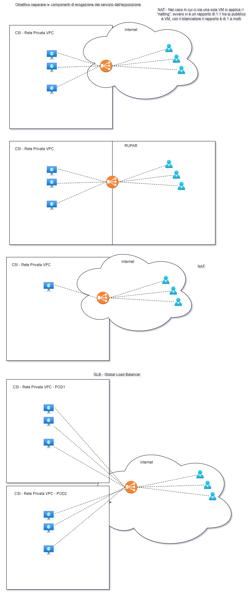

.. _Istruzioni_per_una_configurazione_sicura:

**Istruzioni per una configurazione sicura**
********************************************

.. toctree::
    ../Come_fare_per/11.5_Gestione_chiavi_ssh.rst
    ../Come_fare_per/15.3_Template_Sicurezza.rst

**Load balancer**
-----------------

L’obiettivo è di separare la componente di erogazione del servizio dall’esposizione:  

la sicurezza viene garantita attraverso il disaccoppiamento tra il mondo internet e la rete privata, e tra la rupar e la rete privata.

Inoltre il bilanciatore ha l'obiettivo di ripartire il carico su più elementi per aumentare la resilienza del servizio.

Nel caso in cui ci sia una sola VM si applica il Natting: viene utilizzato un IP pubblico che espone una solo macchina e occorre effettuare il bilanciamento.
Vi è un rapporto di 1:1 tra IP pubblico e VM, al contrario con il bilanciatore il rapporto è di 1 a molti

Per attivare il servizio occorre contattare il Supporto attraverso i consueti canali.
