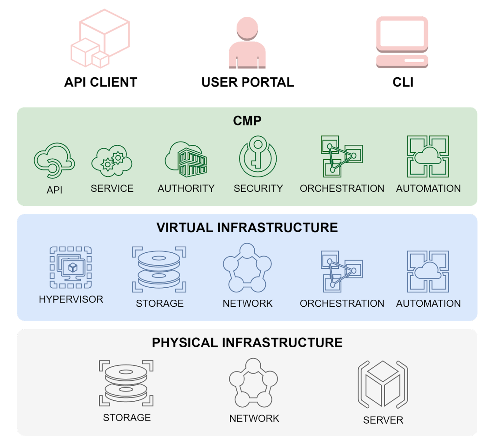
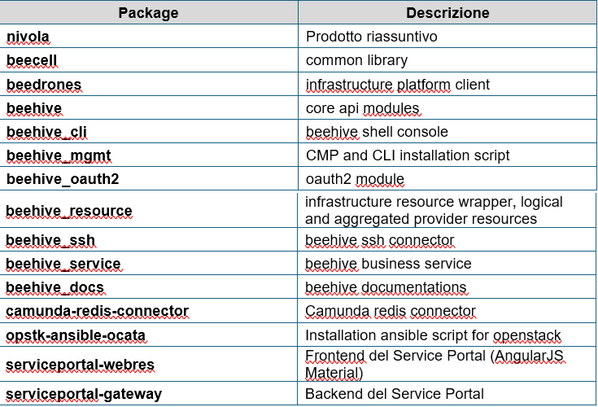

.. _Cosa_e_Nivola:

**Cosa è Nivola?**
******************

Nivola è una piattaforma completamente open source che semplifica l’utilizzo dei servizi cloud da parte della pubblica amministrazione. 
È stata realizzata dal CSI-Piemonte e mette a disposizione potenza di calcolo, storage, rete, database e molti altri servizi. 
Consente alle Business Unit del CSI-Piemonte ed alle Amministrazioni, una completa autonomia nella creazione e gestione dei servizi 
cloud necessari al funzionamento del proprio sistema informativo e nella migrazione delle applicazioni, in assoluta sicurezza. 
Nivola, che mira a creare una Infrastruttura regionale abilitante sul modello degli «SHARED SERVICES» con capacità di integrazione di 
servizi pubblici locali, centrali e servizi di mercato, si inserisce nel percorso evolutivo del Data Center del Consorzio e della sua 
trasformazione secondo il paradigma del Software Defined Data Center (SDDC) allo scopo di ridurre il TCO e migliorarne la flessibilità, 
la scalabilità, l’automazione, la sicurezza e la capacità di integrazione e di federazione con i cloud di mercato, di altre PA e con i 
servizi per la pubblica amministrazione erogati centralmente a livello nazionale. 
La piattaforma è dispiegata in diverse Availability Zone (AZ) chiamate anche POD (Point of Delivery), questo consente di distribuire 
il servizio e di offrire una resilienza anche in caso di eventi disastrosi. 

|

**100% Open Source**
--------------------

Nivola è una piattaforma open source di proprietà della pubblica amministrazione che ne controlla l’evoluzione e può pianificarne
gli sviluppi futuri. Questa libertà dalle tecnologie di mercato garantisce la stabilità necessaria per costruire un
sistema informatico all’avanguardia e senza incorrere in investimenti aggiuntivi dovuti a lock-in tecnologici.

Dal punto di vista delle scelte tecnologiche, si è privilegiato l’ambito dei prodotti open source, ed in particolare la piattaforma 
di riferimento è OpenStack, alla quale si affiancano strumenti e moduli esterni di supporto, monitoraggio e integrazione. Risulta 
necessario al contempo mantenere l’integrazione con altre piattaforme di virtualizzazione commerciali quali VMware vSphere al fine 
di garantire il soddisfacimento di precisi requisiti di supporto, compatibilità o di licensing.

Nato da un progetto della NASA e di Rackspace, oggi OpenStack è il frutto della collaborazione di migliaia di sviluppatori. 
Alla community partecipano più di 60.000 membri e oltre 600 aziende da più di 180 paesi nel mondo. Nivola estende le funzionalità 
base di OpenStack con servizi e processi specifici per la PA e per le imprese ed il codice è rilasciato alla community open 
source sotto licenza GPL v3, coinvolgendo il mondo della ricerca e le stesse amministrazioni interessate a sostenerne lo sviluppo.

|

**Un mondo di servizi semplici e personalizzabili**
---------------------------------------------------

Nivola semplifica l’adozione, l’accesso e l’utilizzo di nuovi servizi applicativi in cloud, indipendentemente dal modello
di sourcing scelto dall’amministrazione, sia esso di sviluppo interno, di acquisizione dal mercato o di riuso da altra
amministrazione. Il Cliente ha a disposizione un ampio catalogo di servizi facilmente adattabili alle proprie esigenze,
esposti attraverso le Application Program Interfaces (API), un insieme uniforme di funzionalità accessibili via software.

Il progetto Nivola ha realizzato una moderna piattaforma cloud mettendo a disposizione infrastrutture “cloud ready”, servizi di automazione, 
ervizi di orchestrazione, tools di controllo e governo ed un Service Portal rivolto all’utente in grado di governare l’intero ciclo di vita 
dei servizi cloud. Il cuore della piattaforma è rappresentato dalla Cloud Management Platform (CMP) che è stata sviluppata in Python e che 
dal punto di vista architetturale offre uno strato di API di business (Application Programming Interface) esposte tramite Web Services di 
tipo REST (REpresentational State Transfer).

|

**CMP**
-------

La CMP rappresenta l’interfaccia di comunicazione rispetto ai diversi back-end e permette l'automazione e l'orchestrazione dei servizi cloud 
veicolati all’utente finale tramite un portale web che ha l’obiettivo di semplificare l’esperienza utente nascondendo la complessità sottostante. 
La CMP è corredata da una Command Line Interface (CLI) che consente al personale tecnico di controllare e amministrare completamente la piattaforma 
ad un maggiore livello di granularità. 
Il diagramma di contesto che riassume i macro-livelli di Nivola può essere rappresentato graficamente e sono i seguenti:

•	il I° è quello dove si realizza l’interazione tra l’utente e tutta la piattaforma;

•	il II° è la parte relativa alle componenti core della CMP;

•	il III° strato include tutto il sistema di orchestrazione, automazione e virtualizzazione;

•	il IV° ed ultimo è composto dalle componenti di backend, capacità computazionale, storage e rete

Dal punto di vista dell’organizzazione del software, il codice Nivola è ospitato su un’istanza di Gitlab del CSI-Piemonte e sono presenti i seguenti package:

Il codice è rilascio con una licenza GPL 3.0

|

**Service Portal**
------------------

Il Service Portal è il portale con funzionalità consumer e di backoffice a cui consumer e provider accedono per il governo dei servizi esposti da Nivola. 
L’interfaccia è in grado di cooperare con le API di business esposte dalla CMP. Dal Service Portal, inoltre, si accede alla documentazione, alle comunicazioni, 
al servizio di ticketing affidato al Team di Supporto Nivola.
Il Service Portal è diviso in due componenti principali:

•	un client web scritto in AngularJS 

•	una componente a servizi REST di backend basato sul framework Spring Boot e scritta in Java 

Di seguito il riepilogo delle principali tecnologie utilizzate per lo sviluppo dei due componenti del SP:

Client Web	        Angular 	

-	                Material Design Lite 	

-	                jQuery 	 

-	                HTML 	 

-	                CSS 	

Backend 		

-	                Apache Web Server 	 

-	                Java JDK 	

-	                Spring (Core, MVC) 	

-	                Spring Security  

-	                Spring Data - JPA  

-	                Spring Boot 	 

-	                Hibernate 	 

Dal punto di vista del diagramma di deploy, l’applicazione Service Portal è distribuita sulla medesima piattaforma Nivola e prevede nella sua architettura di 
sistema, la presenza di un’istanza per ciascuna delle Availability Zones (AZ) bilanciata geograficamente garantendo così un sistema di alta affidabilità 
localmente al pod e di continuità di erogazione del servizio anche 
a fronte dell’indisponibilità completa di un’AZ
