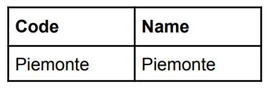

.. _3_Cosa_sono_le_Region:

**Cosa sono le Region?**
************************

**Modello Multi-Region**
=========================

Nivola può essere ospitato in più locations in tutto il mondo. Queste locations sono composte da Region e
Availability Zones. Ogni Region è un'area geografica separata. Ogni Region ha più sedi isolate
note come Availability Zones. Nivola offre la possibilità di posizionare risorse, come istanze e dati
in più locations. Le risorse non vengono replicate tra le Region, a meno che non venga richiesto specificatamente.
Ogni Region è completamente indipendente. Ogni Availability Zones è isolata, ma le Availability Zones in una
Region sono connesse tramite collegamenti a bassa latenza. Il diagramma seguente illustra la relazione tra
Region e Availability Zones:

.. image:: img/relationshipRegion_AvZone.png

**Available Regions**
Le Region a disposizione sono determinate dall'account in uso.
La tabella seguente elenca le Region fornite da un account. Non è possibile accedere a Region esterne all'account in uso:

Le **Region** sono insiemi di **Availability Zones**. Le Availability Zones hanno connessioni di rete a bassa latenza e a larghezza di banda elevata con altre  
Availability Zones della stessa Region. 
Le risorse che risiedono in una Availability Zones, come istanze di macchine virtuali o dischi a livello di zona, sono definite risorse di zona. Altre risorse, come 
indirizzi IP esterni statici, sono a livello di area geografica. Le risorse a livello di area geografica possono essere utilizzate da qualsiasi risorsa di 
quell'area, indipendentemente dalla zona, mentre le risorse di zona possono essere utilizzate solo da altre risorse della stessa zona.
Ad esempio, per collegare un disco permanente a livello di zona a un'istanza, entrambe le risorse devono trovarsi nella stessa zona. Analogamente, se si 
vuole assegnare un indirizzo IP statico a un'istanza, questa deve trovarsi nella stessa regione dell'indirizzo IP statico.
Collocando le risorse in zone diverse di un'area geografica si riduce il rischio di un'interruzione dell'infrastruttura che interessa contemporaneamente 
tutte le risorse. Collocando le risorse in diverse regioni si ottiene un livello ancora più elevato di indipendenza dagli errori.

**Scelta di una region e di una zona**

La scelta di un'area geografica e di una zona è importante per diversi motivi:

**Gestione degli errori**

Distribuire le risorse su più zone e aree geografiche serve a tollerare le interruzioni. Le zone sono progettate per ridurre al minimo il rischio di errori 
correlati causati da interruzioni dell'infrastruttura fisica, ad esempio alimentazione, raffreddamento o rete. Pertanto, se una zona non è più disponibile, 
è possibile trasferire il traffico in un'altra zona della stessa area geografica per mantenere i servizi in esecuzione. 

**Latenza di rete ridotta**
Per ridurre la latenza di rete, è possibile scegliere un'area geografica o una zona vicina al proprio punto di servizio. 

