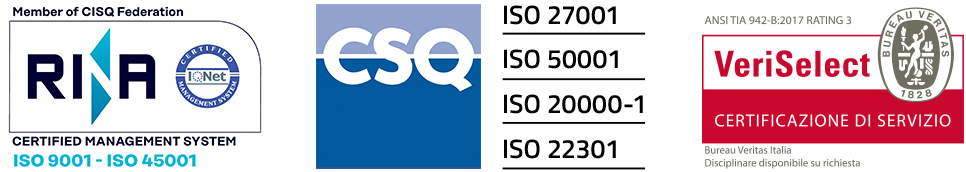
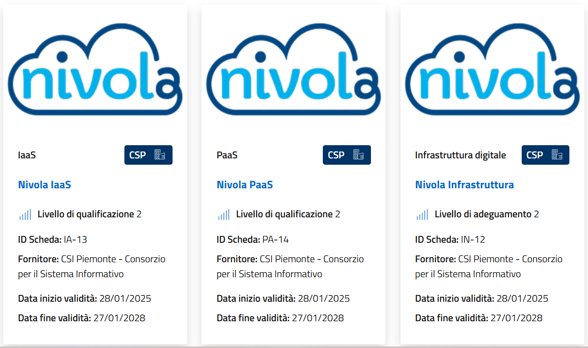

| 

**Certificazioni e Compliance**
*******************************

Per noi Sicurezza e Privacy sono fondamentali e così importanti
che lo sviluppo della piattaforma Nivola è stato
condotto tenendo in considerazione tre aspetti determinanti:

- **sicurezza informatica**
- **organizzazione del servizio**
- **affidabilità**.

Partendo da questi pilastri sono stati individuati servizi, processi,
organizzazione e soluzioni informatiche che rispondessero appieno
alle normative italiane ed internazionali in particolare per i
servizi di cloud computing e per i data center che ospitano le
Availability Zones Nivola inclusa la connettività attestata presso i
data center di Torino, Genova e Milano. Applicando questi vincoli abbiamo
ottenuto le più importanti certificazioni in ambito Cloud che ci
rendono conformi ai maggiori standard di sicurezza e affidabilità.

|

**Qualità**

Il Sistema di gestione per la qualità del CSI è certificato **ISO 9001** per le attività di:

- progettazione, realizzazione, interconnessione, manutenzione, addestramento, gestione e conduzione operativa di 
  **sistemi informativi automatizzati e di servizi informatici applicativi, infrastrutturali e di rete** (settore EA 33)

- progettazione e erogazione di **interventi formativi** e formazione sui servizi ICT erogati (settore EA 37)

Il Sistema prevede la gestione sistematica dei rischi e delle opportunità, il monitoraggio 
costante dei processi aziendali per garantire standard di qualità e il rispetto di tempi e 
ùcosti del servizio. Un sistema di indicatori verifica il raggiungimento degli obiettivi e 
definisce eventuali azioni preventive e correttive.

|

**Sicurezza delle informazioni**

Il Sistema di gestione per la sicurezza delle informazioni del CSI è certificato **ISO/IEC 27001:2022** 
per le attività di progettazione, sviluppo, realizzazione e gestione integrata di servizi di data center, 
soluzioni cloud (IaaS, PaaS, SaaS), infrastrutture di telecomunicazione e servizi di sicurezza informatica.

Il Sistema ha inoltre acquisito l'attestazione di conformità secondo le linee guida **ISO/IEC 27017** per 
l’applicazione dei controlli ISO 27002 nei servizi cloud e **ISO/IEC 27018** per la protezione dei dati personali 
nei servizi cloud.

Nel 2024 il CSI ha conseguito la certificazione internazionale **CSA Star2** , che certifica l’affidabilità, 
la sicurezza e la trasparenza dei servizi cloud e si integra con il sistema ISO 27001. Lo schema misura la 
maturità dei controlli di sicurezza implementati. La certificazione CSA Star 2 rientra tra i requisiti di 
sicurezza dei servizi cloud per la PA italiana richiesti dall’Agenzia per la Cybersicurezza Nazionale.

L'efficacia del Sistema e il raggiungimento degli obiettivi per la sicurezza delle informazioni sono monitorati 
attraverso un sistema di indicatori raccolti e riesaminati con continuità e tramite audit periodici di prima e 
di terza parte.

|

**Salute e sicurezza sul lavoro**

Il Sistema di gestione per la salute e sicurezza sul lavoro del CSI è certificato **ISO 45001** per:

- eliminare o ridurre i rischi per i lavoratori, gli ospiti e le terze parti, adottando misure preventive e protettive

- disporre di uno strumento gestionale che assicuri il rispetto delle normative in materia di salute e sicurezza sul lavoro

- migliorare con continuità la sicurezza dei lavoratori, dei luoghi di lavoro, della strumentazione e degli edifici

- dotarsi di un adeguato sistema di preparazione e risposta alle emergenze

Il Sistema prevede il monitoraggio costante dei siti e delle attività aziendali per garantire elevati standard di sicurezza; 
un sistema di indicatori verifica il raggiungimento degli obiettivi e definisce le azioni di miglioramento da adottare.

|

**Sistema di gestione integrato**

Adottiamo diversi sistemi di gestione certificati, con un solo obiettivo: migliorare continuamente le prestazioni dei 
nostri processi aziendali

|

**Continuità operativa**

Il Sistema di gestione per la continuità operativa del CSI è certificato **ISO 22301** per le attività di progettazione, 
sviluppo, realizzazione e gestione integrata di servizi di data center, soluzioni cloud (IaaS, PaaS, SaaS), infrastrutture 
di telecomunicazione e servizi di sicurezza informatica. Permette di:

- valutare gli impatti derivanti da eventi che possano compromettere la disponibilità dei servizi

- identificare i pericoli, valutarne il rischio e adottare appropriate misure di mitigazione

- predisporre adeguate strategie e definire piani e procedure di gestione della crisi

- definire la struttura organizzativa di risposta alla crisi

|

**Affidabilità del data center**

Il data center, gli impianti e le server room del CSI sono certificati **ANSI/TIA 942 B** con un **RATING 3** per ognuno degli ambiti previsti:

- architettura e collocazione geografica

- sicurezza e sorveglianza

- sistemi antincendio

- impianti meccanici di raffreddamento

- impianti per la continuità e la distribuzione elettrica

- connettività e telecomunicazioni

Con questa certificazione il CSI garantisce il rispetto delle direttive AgID e ACN per i Cloud Service Provider con un alto 
livello di affidabilità dei propri impianti. Il rating 3 assicura la disponibilità dei servizi del data center e la possibilità 
di eseguire qualsiasi tipo di manutenzione senza interruzioni e fermi programmati.

|

**Efficienza energetica**

Il Sistema di gestione per l'energia del CSI è certificato secondo la norma **ISO 50001**.

Il sistema è stato pianificato e applicato nel rispetto dei requisiti legislativi in campo energetico 
ed è finalizzato a garantire l'efficienza energetica dei processi produttivi promuovendo:

- il risparmio energetico e la riduzione progressiva degli sprechi

- l'ottimizzazione degli attuali usi energetici, in particolare per ciò che riguarda il data center e il riscaldamento/condizionamento degli edifici

- una valutazione, nei processi di acquisto, degli aspetti relativi all'efficienza energetica

Il sistema prevede l'identificazione degli usi energetici significativi e il monitoraggio costante degli indicatori individuati 
su di essi e inoltre, nel rispetto delle esigenze elaborative e di continuità operativa richieste per l'erogazione dei servizi, 
la definizione e il perseguimento di obiettivi di efficienza energetica definiti a livello aziendale.

|

**Gestione dei servizi**

Per l’erogazione dei servizi informatici il CSI segue le indicazioni della Information Technology Infrastructure 
Library (ITIL) promosse dall’associazione **itSMF Italia** (https://www.itsmf.it/), di cui il CSI è socio fondatore 
e che fa parte di **itSMF International** (https://www.itsmfi.org/).

Il modello ITIL è usato per:

-adottare le best practice a livello internazionale nell’erogazione dei servizi
- standardizzare le modalità di erogazione dei servizi e monitorare le attività
- diffondere le conoscenze per garantire migliori prestazioni dei servizi
- adottare processi di Change, Incident e Problem Management per garantire il rispetto dei contratti con i clienti e la loro soddisfazione

Il CSI si è inoltre dotato di un Sistema di gestione dei servizi certificato secondo la norma **ISO/IEC 20000-1**
per le attività di progettazione, sviluppo, realizzazione e gestione integrata di servizi di data center, soluzioni 
cloud (IaaS, PaaS, SaaS), infrastrutture di telecomunicazione e servizi di sicurezza informatica.

|

**Ambiente**

Il Sistema di gestione per l'ambiente del CSI è certificato secondo la norma **ISO 14001** per la progettazione, 
lo sviluppo e l‘erogazione di servizi di data center e facility, servizi di cloud computing in modalità IaaS, PaaS 
e SaaS, servizi applicativi, infrastrutturali e di rete.

La certificazione costituisce garanzia del rispetto del principio europeo DNSH “Do No Significant Harm” 
nell'erogazione di servizi cloud, ovvero della minimizzazione degli impatti sull’ambiente.
Il sistema è finalizzato a minimizzare l’impatto ambientale delle attività del CSI e identifica gli aspetti 
ambientali significativi sui quali effettuare un monitoraggio continuo, per il progressivo miglioramento della sostenibilità.

|

**Qualifiche ACN**

Le Infrastrutture e Servizi Cloud Nivola sono qualificate/adeguate ACN Livello 2 e sono esposte nel catalogo ACN delle infrastrutture e dei servizi cloud.

|

 |pic1|

