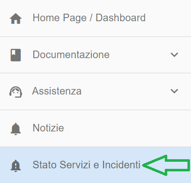
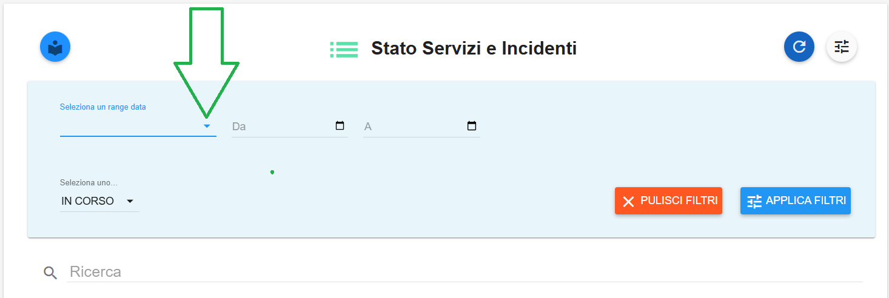
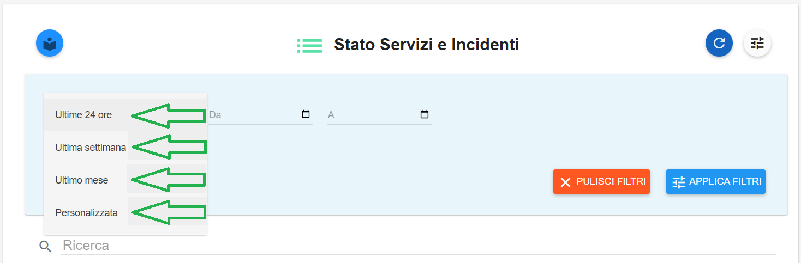
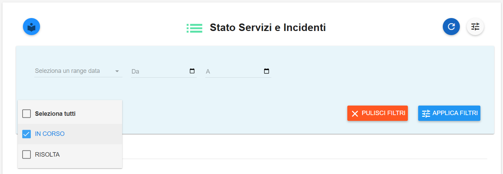
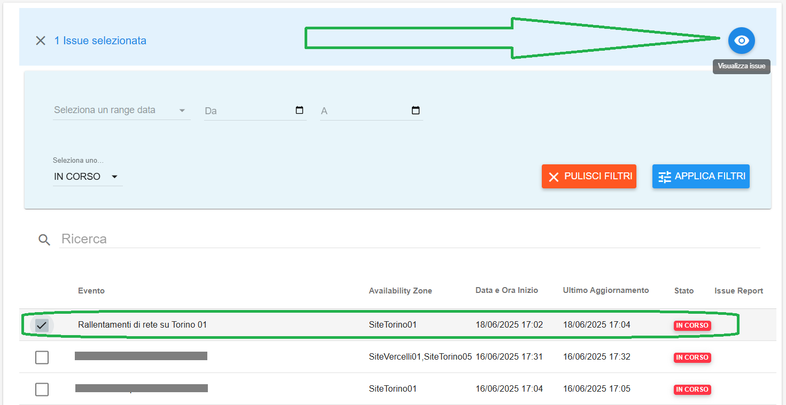
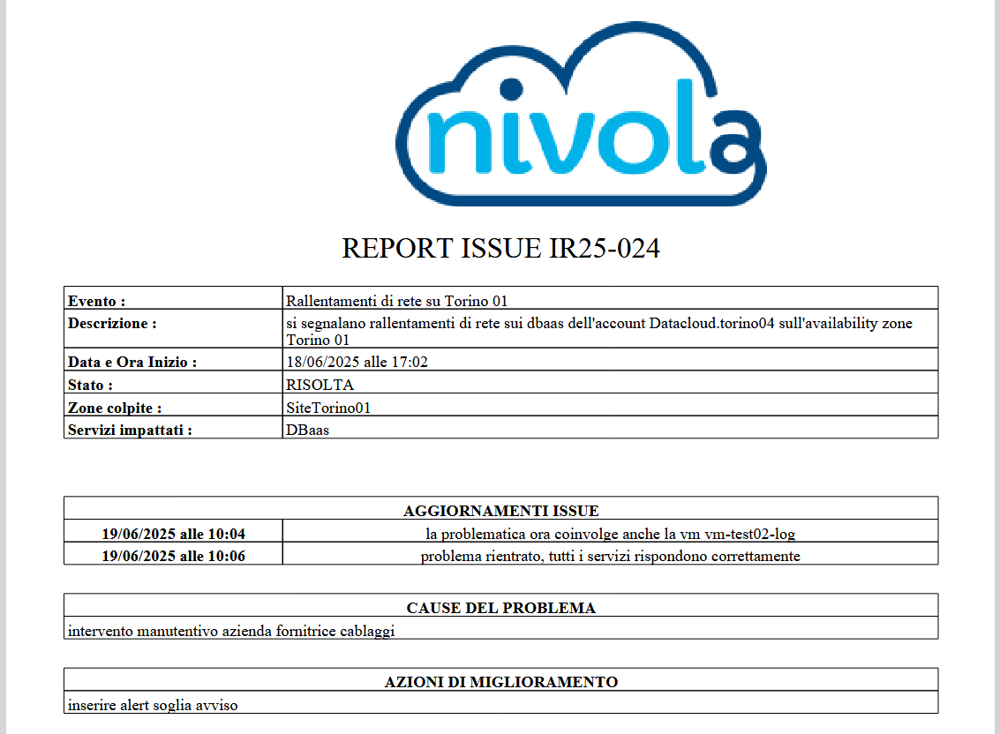

**Incidente Dashboard**
#######################

La funzione è accedibile dal menù sulla sinistra dalla voce **Stato Servizio e Incidenti**

|

Il sistema popolerà la parte destra del video con la lista delle issue afferenti allo Stato Servizi e Incidenti del Portale

.. image:: img2/110.0_Incident_dashboard2.png

|

**Ricercare una issue**
***********************

E' possibile fare ricerche su tutti le issue nel sistema, attraverso uno o più dei seguenti metodi:

1. attraverso un range temporale, scegliendolo fra uno di quelli proposti

|

2. attraverso l'inserimento di date specifiche

.. image:: img2/110.0_Incident_dashboard5.png

.. image:: img2/110.0_Incident_dashboard6.png

|

3. attraverso il filtro degli stati

.. image:: img2/110.0_Incident_dashboard7.png

|

**Visualizzare una issue**
**************************

1. individuare una issue dalla lista, mettere una spunta a fianco del nome e cliccare sul pulsante "Visualizza issue"

    
|

2. verranno visualizzate le informazioni della issue
    
.. image:: img2/110.0_Incident_dashboard10.png

|

**Salvataggio report issue**
****************************

Per effettuare tale operazione devono essere rispettate le due seguenti condizioni:

- la issue essere in stato "RISOLTA"

- deve essere stata precedentemente attivata dall'Amministratore di backoffice l'apposita funzionalità "Compila Report"

1. individuare una issue dalla lista, quindi cliccare sul pulsante azzurro "PDF" all'estrema destra della relativa riga

.. image:: img2/110.0_Incident_dashboard11.png

|

2. dal browser apparirà il relativo pop-up relativo al download

.. image:: img2/110.0_Incident_dashboard12.png

|

3. esempio di report scaricato

